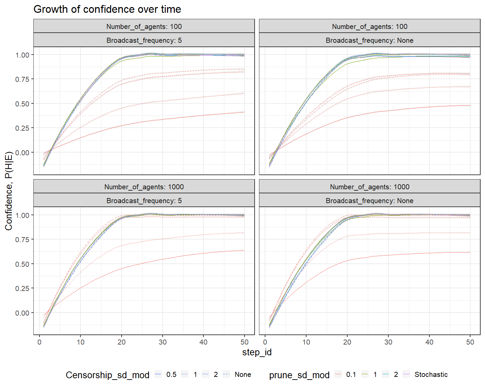
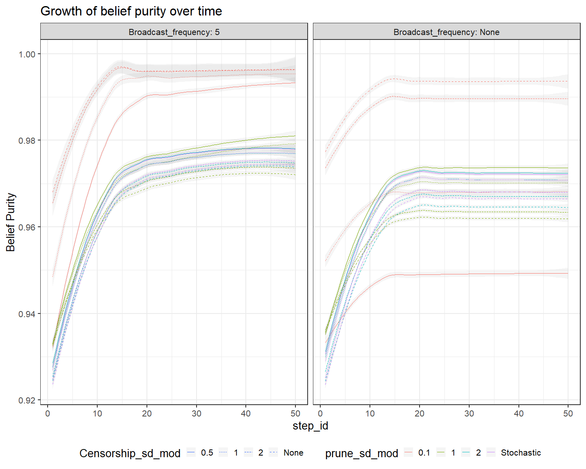
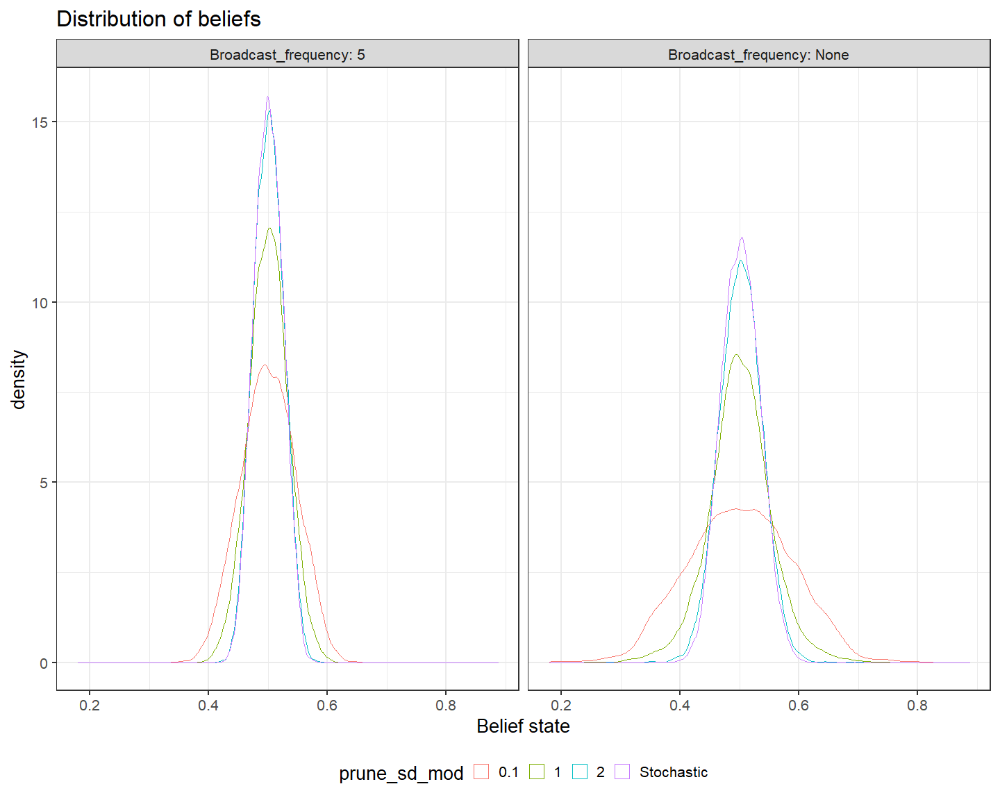
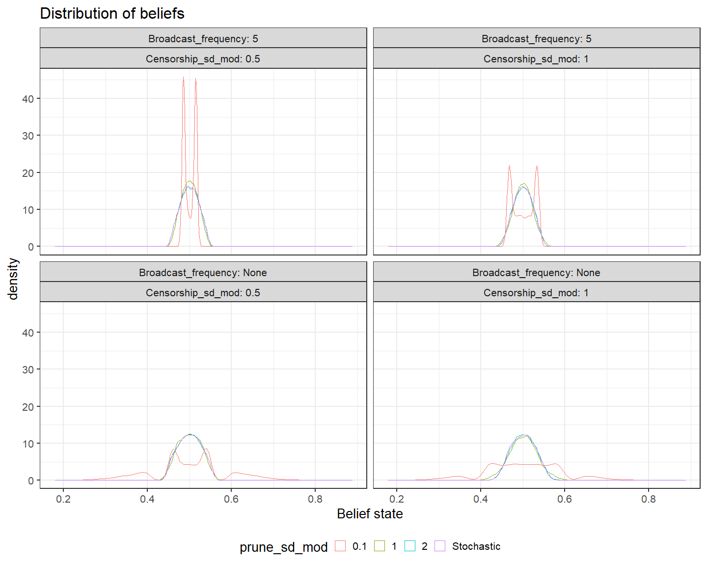
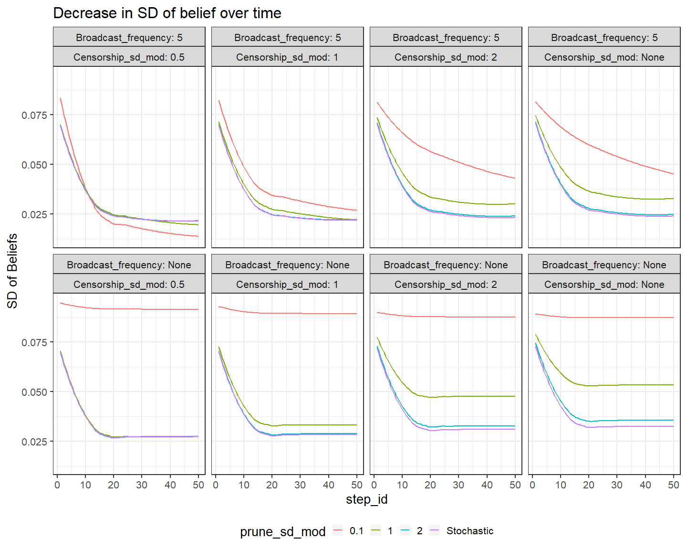
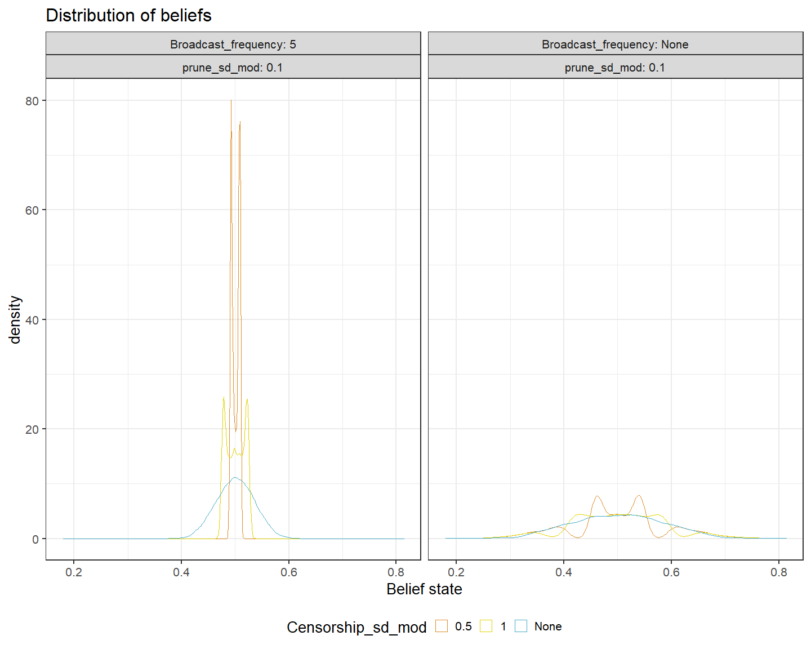
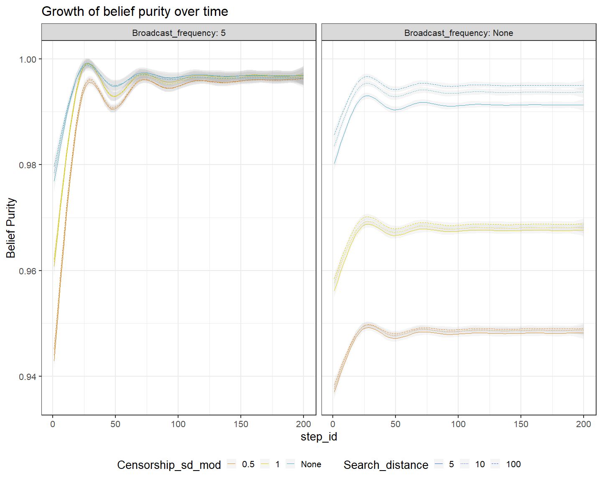
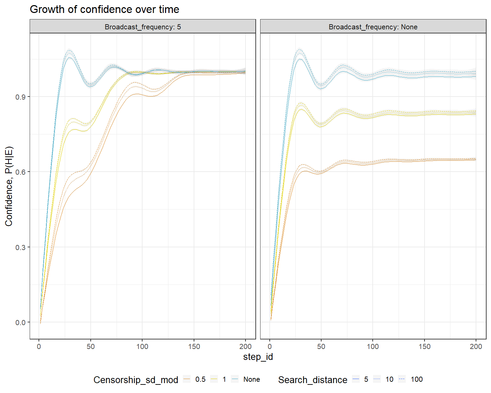

Plotting Echo-Chamber ABM
================
Peter Thramkrongart and Asger Lakkenborg
11/5/2020

## Here we are loading the data

``` r
setwd("D:\\Users\\thram_000\\OneDrive\\cog data\\SocKult\\ABM_SocKult")
pacman::p_load(rJava, RNetLogo, tidyverse, parallel,egg,wesanderson)

ABM_Data <- read_csv("D:\\Users\\thram_000\\OneDrive\\cog data\\SocKult\\ABM_SocKult\\ABM_Data10.csv")
```

    ## Warning: Missing column names filled in: 'X1' [1]

    ## Parsed with column specification:
    ## cols(
    ##   .default = col_double(),
    ##   SF_setup_YN = col_logical(),
    ##   broadcast_freq = col_character(),
    ##   prune_sd_mod = col_character(),
    ##   censorship_mod = col_character(),
    ##   always_search_YN = col_logical()
    ## )

    ## See spec(...) for full column specifications.

``` r
distributionData <- read_csv("DistributionData10.csv")
```

    ## Warning: Missing column names filled in: 'X1' [1]

    ## Parsed with column specification:
    ## cols(
    ##   X1 = col_double(),
    ##   SF_setup_YN = col_logical(),
    ##   numlearners = col_double(),
    ##   search_distance = col_double(),
    ##   broadcast_freq = col_character(),
    ##   prune_sd_mod = col_character(),
    ##   censorship_mod = col_character(),
    ##   always_search_YN = col_logical(),
    ##   SF_density_mod = col_double(),
    ##   Prior_sd = col_double(),
    ##   prior_sample_size = col_double(),
    ##   agent_prior = col_double(),
    ##   broadcast_val = col_double(),
    ##   param_set_id = col_double(),
    ##   who = col_double(),
    ##   `my-p-h` = col_double(),
    ##   `prior-val` = col_double(),
    ##   run_id = col_double(),
    ##   step_id = col_double()
    ## )

``` r
ABM_Data <-
  ABM_Data %>% mutate_at(
    c(
      "censorship_mod",
      "numlearners",
      "broadcast_freq",
      "prune_sd_mod",
      "search_distance",
      "run_id",
      "param_set_id"
    ),
    as.factor
  )

distributionData <-
  distributionData %>% mutate_at(
    c(
      "censorship_mod",
      "numlearners",
      "broadcast_freq",
      "prune_sd_mod",
      "search_distance",
      "run_id",
      "param_set_id"
    ),
    as.factor
  ) 

ABM_Data <- ABM_Data %>% 
  rename(
    Number_of_agents = numlearners,
    Broadcast_frequency = broadcast_freq,
    Censorship_sd_mod = censorship_mod,
    Search_distance = search_distance
    )


distributionData <- distributionData %>% 
  rename(
    Number_of_agents = numlearners,
    Broadcast_frequency = broadcast_freq,
    Censorship_sd_mod = censorship_mod,
    Search_distance = search_distance
    )

ABM_DataBasic <- ABM_Data %>% 
  filter(Number_of_agents == 1000,Broadcast_frequency == "None", Censorship_sd_mod == "None")

distributionDataBasic <- distributionData %>% 
  filter(Number_of_agents == 1000,Broadcast_frequency == "None", Censorship_sd_mod == "None")

theme_set(theme_bw(base_size = 20) + theme(legend.position = "bottom"))
```

``` r
distributionData %>% filter(Number_of_agents == 1000) %>%
  ggplot(aes(`prior-val`,
             Search_distance,
             fill = prune_sd_mod))  +
  facet_wrap(Censorship_sd_mod ~ Broadcast_frequency, labeller = label_both) + geom_boxplot(outlier.size = 0.1) +
  ggtitle("Distribution of beliefs") +
  labs(x = "Belief state")
```

<!-- -->

``` r
ABM_Data %>% filter(Number_of_agents == 1000, Search_distance != 10) %>%
  ggplot(aes(step_id,
             glob_p_h,
             color = prune_sd_mod)) +
  facet_wrap(Search_distance ~ Censorship_sd_mod ~ Broadcast_frequency,
             labeller = label_both) +
  geom_smooth(size = 0.1, alpha = 0.1) +
  ggtitle("Growth of confidence over time") +
  labs(y = "Confidence, P(H|E)")
```

    ## `geom_smooth()` using method = 'loess' and formula 'y ~ x'

<!-- -->

``` r
ABM_Data %>%
  filter(Number_of_agents == 1000) %>%
  ggplot(aes(step_id,
             glob_p_h,
             linetype = Censorship_sd_mod,
             color = prune_sd_mod)) +
  facet_wrap(Search_distance  ~ Broadcast_frequency, labeller = label_both) +
  geom_smooth(size = 0.1, alpha = 0.1) +
  ggtitle("Growth of confidence over time") +
  labs(y = "Confidence, P(H|E)")
```

    ## `geom_smooth()` using method = 'loess' and formula 'y ~ x'

<!-- -->

``` r
ABM_Data %>%
  ggplot(aes(step_id,
             glob_p_h,
             linetype = Censorship_sd_mod,
             color = prune_sd_mod)) +
  facet_wrap(Search_distance ~ Number_of_agents ~ Broadcast_frequency,
             labeller = label_both) +
  geom_smooth(size = 0.1, alpha = 0.1) +
  ggtitle("Growth of confidence over time") +
  labs(y = "Confidence, P(H|E)")
```

    ## `geom_smooth()` using method = 'loess' and formula 'y ~ x'

<!-- -->

``` r
ABM_Data %>%
  filter(Number_of_agents == 1000) %>%
  ggplot(aes(step_id,
             glob_purity,
             linetype = Censorship_sd_mod,
             color = prune_sd_mod,)) +
  facet_wrap(Search_distance  ~ Broadcast_frequency, labeller = label_both) +
  geom_smooth(size = 0.1, alpha = 0.1) +
  ggtitle("Growth of belief purity over time") +
  labs(y = "Belief Purity")
```

    ## `geom_smooth()` using method = 'loess' and formula 'y ~ x'

<!-- -->

``` r
distributionData %>% filter(step_id == 50,
                            Number_of_agents == 1000,
                            Censorship_sd_mod == "None") %>%
  ggplot(aes(`prior-val`,
             color = prune_sd_mod)) +
  geom_density() +
  facet_wrap(Search_distance ~
               Broadcast_frequency, labeller = label_both) +
  ggtitle("Distribution of beliefs")  +
  labs(x = "Belief state")
```

<!-- -->

``` r
distributionData %>%
  filter(step_id == "1", Number_of_agents == 1000) %>%
  ggplot(aes(`prior-val`,
             color = prune_sd_mod,
             linetype = Censorship_sd_mod)) +
  facet_wrap(Broadcast_frequency ~ run_id, labeller = label_both) +
  geom_density() + ggtitle("Distribution of beliefs") +
  labs(x = "Belief state")
```

<!-- -->

``` r
distributionData %>%
  filter(Number_of_agents == 1000, Search_distance == 10, step_id == 50) %>%
  ggplot(aes(`prior-val`,
             color = Censorship_sd_mod,
             linetype = Censorship_sd_mod)) +
  facet_wrap(Broadcast_frequency ~ prune_sd_mod, labeller = label_both) +
  geom_density() +
  ggtitle("Distribution of beliefs") +
  labs(x = "Belief state")
```

<!-- -->

``` r
ABM_Data %>%
  filter(Number_of_agents == 1000, Search_distance == 10) %>%
  ggplot(aes(step_id,
             glob_sd,
             color = Censorship_sd_mod,
             linetype = Censorship_sd_mod)) +
  facet_wrap(Broadcast_frequency ~ prune_sd_mod, labeller = label_both) +
  geom_smooth(alpha = 0.1) +
  ggtitle("Decrease in SD of belief over time") +
  labs(y = "SD of Beliefs")
```

    ## `geom_smooth()` using method = 'loess' and formula 'y ~ x'

<!-- -->

``` r
ABM_DataShort <- read_csv("D:\\Users\\thram_000\\OneDrive\\cog data\\SocKult\\ABM_SocKult\\ABM_DataShort5.csv")
```

    ## Warning: Missing column names filled in: 'X1' [1]

    ## Parsed with column specification:
    ## cols(
    ##   .default = col_double(),
    ##   SF_setup_YN = col_logical(),
    ##   broadcast_freq = col_character(),
    ##   censorship_mod = col_character(),
    ##   always_search_YN = col_logical()
    ## )

    ## See spec(...) for full column specifications.

``` r
distributionDataShort <- read_csv("distributionDataShort5.csv")
```

    ## Warning: Missing column names filled in: 'X1' [1]

    ## Parsed with column specification:
    ## cols(
    ##   X1 = col_double(),
    ##   SF_setup_YN = col_logical(),
    ##   numlearners = col_double(),
    ##   search_distance = col_double(),
    ##   broadcast_freq = col_character(),
    ##   prune_sd_mod = col_double(),
    ##   censorship_mod = col_character(),
    ##   always_search_YN = col_logical(),
    ##   SF_density_mod = col_double(),
    ##   Prior_sd = col_double(),
    ##   prior_sample_size = col_double(),
    ##   agent_prior = col_double(),
    ##   broadcast_val = col_double(),
    ##   param_set_id = col_double(),
    ##   who = col_double(),
    ##   `my-p-h` = col_double(),
    ##   `prior-val` = col_double(),
    ##   run_id = col_double(),
    ##   step_id = col_double()
    ## )

``` r
ABM_DataShort <-
  ABM_DataShort %>% mutate_at(
    c(
      "censorship_mod",
      "numlearners",
      "broadcast_freq",
      "prune_sd_mod",
      "search_distance",
      "run_id",
      "param_set_id"
    ),
    as.factor
  )

distributionDataShort <-
  distributionDataShort %>% mutate_at(
    c(
      "censorship_mod",
      "numlearners",
      "broadcast_freq",
      "prune_sd_mod",
      "search_distance",
      "run_id",
      "param_set_id"
    ),
    as.factor
  ) 


ABM_DataShort <- ABM_DataShort %>%
  rename(
    Number_of_agents = numlearners,
    Broadcast_frequency = broadcast_freq,
    Censorship_sd_mod = censorship_mod,
    Search_distance = search_distance
  )


distributionDataShort <- distributionDataShort %>%
  rename(
    Number_of_agents = numlearners,
    Broadcast_frequency = broadcast_freq,
    Censorship_sd_mod = censorship_mod,
    Search_distance = search_distance
  )
```

``` r
distributionDataShort %>%
  filter(Search_distance == 10, step_id == 50) %>%
  ggplot(aes(`prior-val`,
             color = Censorship_sd_mod,
             linetype = Censorship_sd_mod)) +
  facet_wrap(Broadcast_frequency ~ prune_sd_mod, labeller = label_both) +
  geom_density() +
  ggtitle("Distribution of beliefs") +
  labs(x = "Belief state")
```

<!-- -->

``` r
ABM_DataShort %>%
  ggplot(aes(step_id,
             glob_purity,
             linetype = Censorship_sd_mod,
             color = prune_sd_mod,)) +
  facet_wrap(Search_distance  ~ Broadcast_frequency, labeller = label_both) +
  geom_smooth(size = 0.1, alpha = 0.1) +
  ggtitle("Growth of belief purity over time") +
  labs(y = "Belief Purity")
```

    ## `geom_smooth()` using method = 'gam' and formula 'y ~ s(x, bs = "cs")'

<!-- -->

``` r
ABM_DataShort %>%
  filter(Number_of_agents == 1000, Search_distance != 10) %>%
  ggplot(aes(step_id,
             glob_p_h,
             color = prune_sd_mod)) +
  facet_wrap(Search_distance ~ Censorship_sd_mod ~ Broadcast_frequency,
             labeller = label_both) + geom_smooth(size = 0.1, alpha = 0.1) +
  ggtitle("Growth of confidence over time") +
  labs(y = "Confidence, P(H|E)")
```

    ## `geom_smooth()` using method = 'gam' and formula 'y ~ s(x, bs = "cs")'

<!-- -->

``` r
ABM_DataShort %>%
  ggplot(aes(step_id,
             glob_p_h,
             linetype = Censorship_sd_mod,
             color = prune_sd_mod)) +
  facet_wrap(Search_distance ~ Broadcast_frequency, labeller = label_both) +
  geom_smooth(size = 0.1, alpha = 0.1) +
  ggtitle("Growth of confidence over time")
```

    ## `geom_smooth()` using method = 'gam' and formula 'y ~ s(x, bs = "cs")'

<!-- -->
