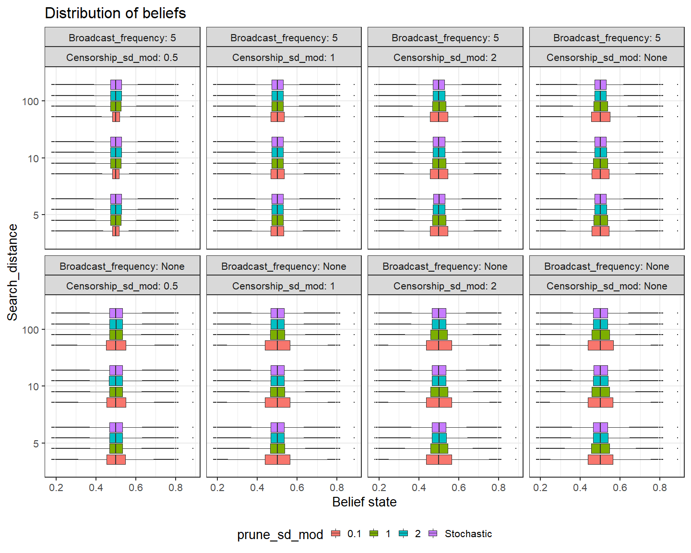
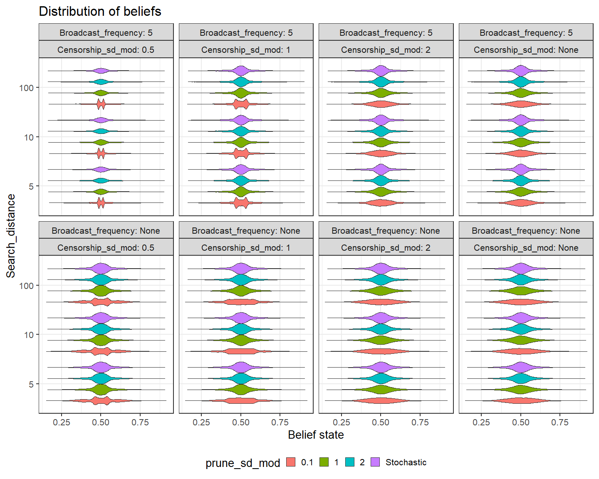

Plotting Echo-Chamber ABM
================
Peter Thramkrongart and Asger Lakkenborg
11/5/2020

## Here we are loading the data

``` r
setwd("D:\\Users\\thram_000\\OneDrive\\cog data\\SocKult\\ABM_SocKult")
pacman::p_load(rJava, RNetLogo, tidyverse, parallel)

ABM_Data <- read_csv("D:\\Users\\thram_000\\OneDrive\\cog data\\SocKult\\ABM_SocKult\\ABM_Data2.csv")
```

    ## Warning: Missing column names filled in: 'X1' [1]

    ## Parsed with column specification:
    ## cols(
    ##   .default = col_double(),
    ##   SF_setup_YN = col_logical(),
    ##   broadcast_freq = col_character(),
    ##   prune_sd_mod = col_character(),
    ##   censorship_mod = col_character(),
    ##   always_search_YN = col_logical()
    ## )

    ## See spec(...) for full column specifications.

``` r
distributionData <- read_csv("DistributionData2.csv")
```

    ## Warning: Missing column names filled in: 'X1' [1]

    ## Parsed with column specification:
    ## cols(
    ##   X1 = col_double(),
    ##   SF_setup_YN = col_logical(),
    ##   numlearners = col_double(),
    ##   search_distance = col_double(),
    ##   broadcast_freq = col_character(),
    ##   prune_sd_mod = col_character(),
    ##   censorship_mod = col_character(),
    ##   always_search_YN = col_logical(),
    ##   SF_density_mod = col_double(),
    ##   Prior_sd = col_double(),
    ##   prior_sample_size = col_double(),
    ##   agent_prior = col_double(),
    ##   broadcast_val = col_double(),
    ##   param_set_id = col_double(),
    ##   who = col_double(),
    ##   `my-p-h` = col_double(),
    ##   `prior-val` = col_double(),
    ##   run_id = col_double(),
    ##   step_id = col_double()
    ## )

``` r
ABM_Data <-
  ABM_Data %>% mutate_at(
    c(
      "censorship_mod",
      "numlearners",
      "broadcast_freq",
      "prune_sd_mod",
      "search_distance",
      "run_id",
      "param_set_id"
    ),
    as.factor
  )

distributionData <-
  distributionData %>% mutate_at(
    c(
      "censorship_mod",
      "numlearners",
      "broadcast_freq",
      "prune_sd_mod",
      "search_distance",
      "run_id",
      "param_set_id"
    ),
    as.factor
  ) %>% mutate_at(
    c(
      "censorship_mod",
      "numlearners",
      "broadcast_freq",
      "prune_sd_mod",
      "search_distance",
      "run_id",
      "param_set_id"
    ),
    as.factor
  )

ABM_DataBasic <- ABM_Data %>% 
  filter(numlearners == 1000,broadcast_freq == "None", censorship_mod == "None")

distributionDataBasic <- distributionData %>% 
  filter(numlearners == 1000,broadcast_freq == "None", censorship_mod == "None")
```

``` r
distributionData %>% filter(numlearners == 1000) %>%
  ggplot(aes(
    `prior-val`,
    search_distance,
    fill = prune_sd_mod
  ))  + facet_wrap(censorship_mod ~ broadcast_freq, labeller = label_both) + geom_boxplot(outlier.size = 0.1) + ggtitle("Distribution of beliefs")
```

<!-- -->

``` r
ABM_Data %>% filter(numlearners == 1000, search_distance != 10) %>%
  ggplot(aes(step_id,
             glob_p_h,
             color = prune_sd_mod)) + facet_wrap(search_distance ~ censorship_mod ~ broadcast_freq, labeller = label_both) + geom_smooth(size = 0.1, alpha = 0.1) + ggtitle("Growth of confidence over time")
```

    ## `geom_smooth()` using method = 'loess' and formula 'y ~ x'

<!-- -->

``` r
ABM_Data %>%
  ggplot(aes(
    step_id,
    glob_p_h,
    linetype = censorship_mod,
    color = prune_sd_mod
  )) + facet_wrap(search_distance ~ numlearners ~ broadcast_freq, labeller = label_both) + geom_smooth(size = 0.1, alpha = 0.1) + ggtitle("Growth of confidence over time")
```

    ## `geom_smooth()` using method = 'loess' and formula 'y ~ x'

<!-- -->

``` r
ABM_Data %>%
  filter(numlearners == 1000) %>%
  ggplot(aes(
    step_id,
    glob_purity,
    linetype = censorship_mod,
    color = prune_sd_mod,
  )) +
  facet_wrap(search_distance  ~ broadcast_freq, labeller = label_both) +
  geom_smooth(size = 0.1,alpha = 0.1) + ggtitle("Growth of belief purity over time")
```

    ## `geom_smooth()` using method = 'loess' and formula 'y ~ x'

<!-- -->

``` r
distributionData %>% filter(step_id == 40, numlearners == 1000, censorship_mod == "None") %>%
  ggplot(aes(`prior-val`,
             color = prune_sd_mod)) + geom_density() + facet_wrap(search_distance ~
                                                                               broadcast_freq, labeller = label_both) + ggtitle("Distribution of beliefs")
```

<!-- -->

``` r
distributionData %>% filter(step_id == "1", numlearners == 1000) %>%  ggplot(aes(
  `prior-val`,
  color = prune_sd_mod,
  linetype = censorship_mod
)) + facet_wrap(broadcast_freq ~ numlearners ~ run_id, labeller = label_both) + geom_density() + ggtitle("Distribution of beliefs")
```

<!-- -->

``` r
distributionData %>% filter(numlearners == 1000, search_distance == 10, step_id == 40) %>%  ggplot(aes(
  `prior-val`,
  color = censorship_mod,
  linetype = censorship_mod
)) + facet_wrap(broadcast_freq ~ prune_sd_mod, labeller = label_both) + geom_density() + ggtitle("Distribution of beliefs")
```

<!-- -->

``` r
ABM_Data %>% filter(numlearners == 1000, search_distance == 10) %>%  ggplot(aes(
  step_id,
  glob_sd,
  color = censorship_mod,
  linetype = censorship_mod
)) + facet_wrap(broadcast_freq ~ prune_sd_mod, labeller = label_both) + geom_smooth(alpha = 0.1) + ggtitle("Decrease in SD of beleif over time")
```

    ## `geom_smooth()` using method = 'loess' and formula 'y ~ x'

<!-- -->
